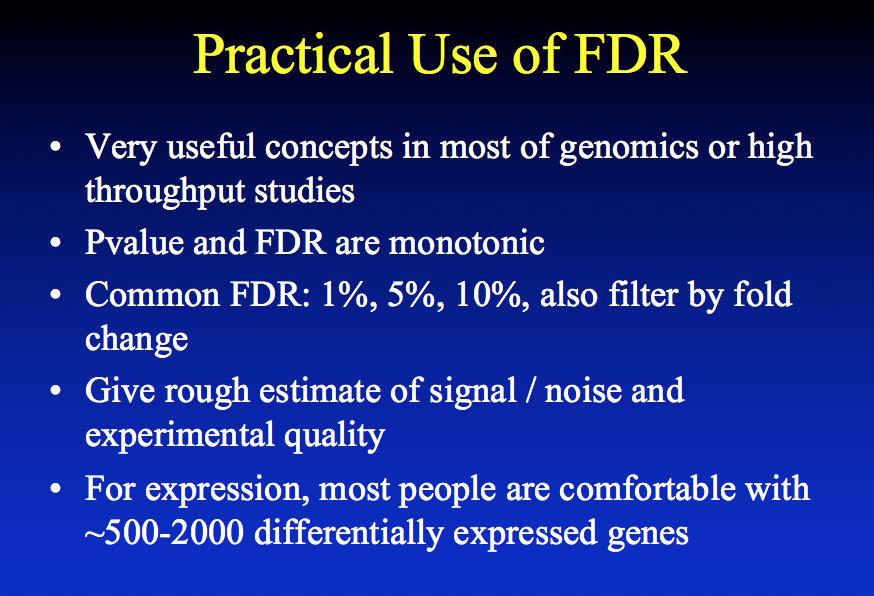
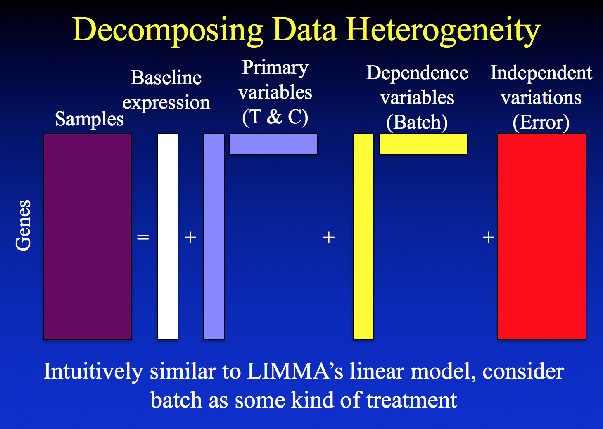
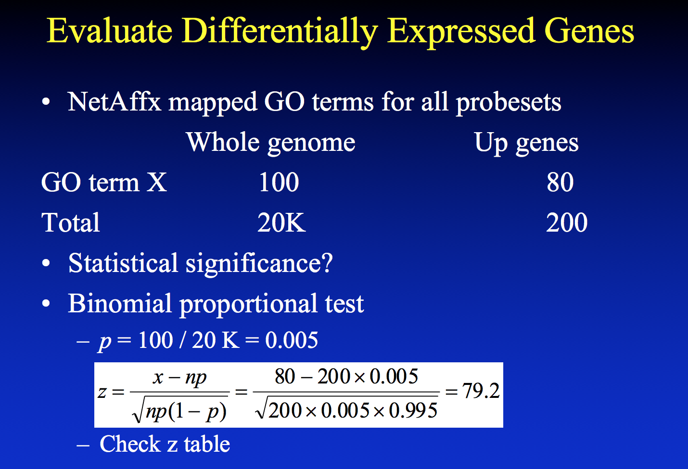

```{r setup, include=FALSE}
knitr::opts_chunk$set(echo = TRUE)
```

## R Markdown

This is an R Markdown document. Markdown is a simple formatting syntax for authoring HTML, PDF, and MS Word documents. For more details on using R Markdown see <http://rmarkdown.rstudio.com>.

When you click the **Knit** button a document will be generated that includes both content as well as the output of any embedded R code chunks within the document. You can embed an R code chunk like this:

We can have several different sizes based on the text structure:

# Big
## Kinda big
### Still biggish
#### Pretty Normal

You can **bold** or *italicize* text very easily. Most significantly, probably, is the ease of embedding images:






\newpage

```{r bioc, eval=FALSE}
## try http:// if https:// URLs are not supported
source("https://bioconductor.org/biocLite.R")
biocLite("affy")
biocLite("hgu133plus2.db")
biocLite("drosophila2.db")

# etc. 
```

```{r loadLibraries, message=FALSE, warning=FALSE, eval=FALSE}
library(knitr)
library(affy)
library(hgu133plus2.db)
library(drosophila2.db)
```

```{r loadData, eval = FALSE}
celFiles <- list.celfiles(path = "data", full.names=TRUE)
data.affy <- ReadAffy(filenames = celFiles)
data.affy
```

Show an MA Plot
```{r MAplot, eval = FALSE}
MAplot(data.affy, pairs = TRUE, which=c(1,2,3,4), plot.method = "smoothScatter")
```

```{r lab1, eval = FALSE}
# Raw data visualization
# MA plot for only the first 4 samples 
image(data.affy)
hist(data.affy)
boxplot(data.affy, col=c(1:4))

# Normalize data
data.rma <- rma(data.affy)
expr.rma <- exprs(data.rma) 

#compare normalized data with raw data
library(affyPLM)
MAplot(data.rma, pairs = TRUE, which=c(1,2,3,4), plot.method = "smoothScatter")
boxplot(data.frame(expr.rma), col=c(1:4))

# Look at gene names
head(rownames(expr.rma), 20)

# Convert gene names
Annot <- data.frame(REFSEQ=sapply(contents(drosophila2REFSEQ), paste, collapse=", "),
                    SYMBOL=sapply(contents(drosophila2SYMBOL), paste, collapse=", "),
                    DESC = sapply(contents(drosophila2GENENAME), paste, collapse=", ")  )

# Merge data frames together (like a database table join)
all <- merge(Annot, expr.rma, by.x=0, by.y=0, all = TRUE)

#find significant up- and down-regulated genes
control <- c(1,2)
mutants <- c(3,4)

# Do a basic T test
foldchange <- apply(expr.rma, 1, function(x) mean( x[mutants] ) - mean( x[control] ) )
T.p.value <- apply(expr.rma, 1, function(x) t.test( x[mutants], x[control], var.equal = TRUE)$p.value )

# fdr <- p.adjust(T.p.value, method="fdr")
genes.up <- all$SYMBOL[ which( T.p.value < 0.05 & foldchange > 0 ) ]
genes.down <- all$SYMBOL[ which( T.p.value < 0.05 & foldchange < 0 ) ]

# Use limma to call differentially expressed genes
library(limma)
design <- c(0, 0, 1, 1) # assign control and trt groups
design.mat <- model.matrix(~design) 
fit <- lmFit(expr.rma, design.mat)
fit <- eBayes(fit)
topTable(fit, coef = "design") 
```

